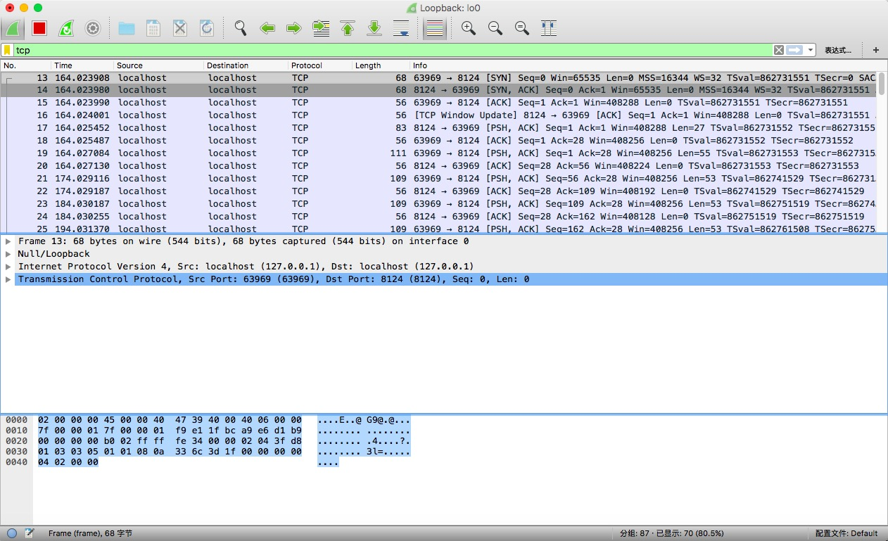
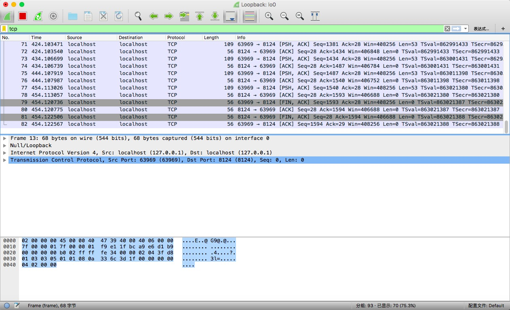
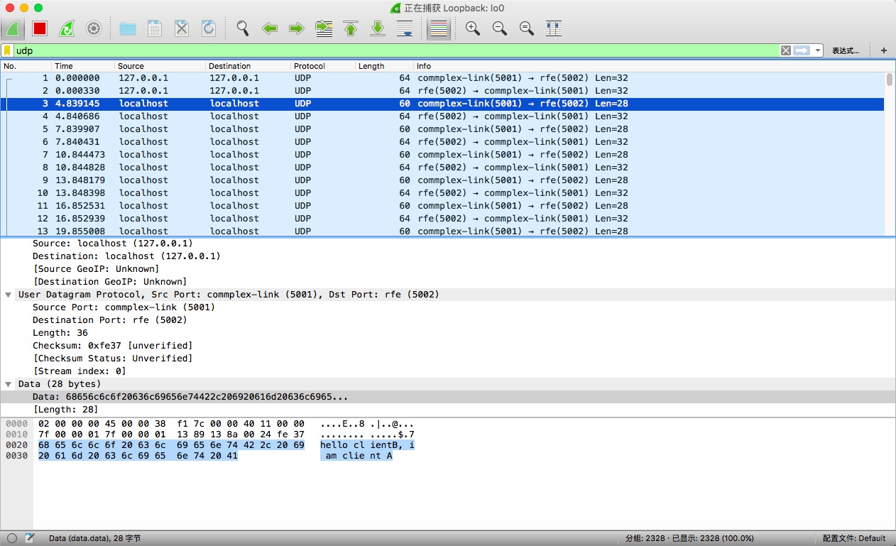

# nodejs-protocol
基于nodejs介绍通讯协议
### TCP
* 参考资料：[zhangxin09专栏](http://blog.csdn.net/zhangxin09/article/details/12844975)&emsp;[nodejs net](http://nodejs.cn/api/net.html)
* 介绍：TCP(Transmission Control Protocol，传输控制协议)。面向连接、可靠、基于字节流。属于物、链、网、传、会、表、应OSI七层模型的传输层 。
* [MSS](https://baike.baidu.com/item/MSS/3567770)：(Maximum Segment Size，最大报文长度)。tcp通信时每一个报文段所能承载的最大数据长度。
* [MTU](https://baike.baidu.com/item/MTU)：(Maximum Transmission Unit，最大传输单元)。通信协议上所能通过的最大数据包大小(以字节为单位)。MTU的大小和数据单元承载的有效数据长度(除开协议数据单元含有的固定长度的包头和包尾)密切相关，和数据包的延迟相关，和数据包中bit位发生错误的概率相关，数值通常与通信接口有关（网络接口卡、串口等）。
* [粘包](https://www.cnblogs.com/kex1n/p/6502002.html) 与接收方和发送方的缓冲区有关。接收方创建预处理线程，将粘连的包分开。
* [三次握手建立连接](https://baike.baidu.com/item/TCP/33012?fr=aladdin#1_4)：clint->server(client发送握手信号SYN(synchronous)给服务端，进入SYN_SEND状态)；server->client(服务器收到SYN报文，回应一个\[SYN,ACK(Acknowledgement)]报文，进入SYN_RECV状态)；client->server(客户端收到服务器\[SYN,ACK]报文，回应ACK，进入Established状态，连接成功)。
* [四次握手关闭连接](https://baike.baidu.com/item/TCP/33012?fr=aladdin#1_4)：client->server(client调用close主动关闭，发送一个\[FIN,ACK]，表示数据发送完成)；server->client(服务器回应ACK)；server->client(服务器确认无数据返回，发送\[FIN,ACK])；client->server(发送ACK)。
* [名词](https://www.cnblogs.com/azraelly/archive/2012/12/25/2832393.html)：SYN表示建立连接；FIN表示关闭连接；ACK表示响应；PSH表示有 DATA数据传输；RST表示连接重置；其中，ACK是可能与SYN，FIN等同时使用的，比如SYN和ACK可能同时为1，它表示的就是建立连接之后的响应，如果只是单个的一个SYN，它表示的只是建立连接。
* [Wireshark](https://www.wireshark.org/download.html) 分析：选中活跃网卡，在示例代码中请选中本机环路lo0。启动tcp/server.js；启动clientA.js；筛选出tcp协议可观察到建立握手和发送数据的信息。关闭clientA.js可以观测到tcp断开连接信息。如图所示：
   
### UDP
* 参考资料：[UDP协议](https://baike.baidu.com/item/UDP/571511?fr=aladdin&fromid=421768&fromtitle=UDP%E5%8D%8F%E8%AE%AE)&emsp;[nodejs_dgram](http://nodejs.cn/api/dgram.html)
* 介绍：UDP(User Datagram Protocol，用户数据报协议)。面向事务、无连接、简单、不可靠。同属于传输层。应用于语音视频等可靠性要求相对较低的数据传输服务。
* [Wireshark](https://www.wireshark.org/download.html) 分析：选中活跃网卡，在示例代码中请选中本机环路lo0。启动udp/clientA.js；启动/udp/clientB.js；如图所示：
  
* 拷贝Data中的值，使用showData.js，可以解析data。
### IP
* 参考资料：[CSDN roverliang](https://www.cnblogs.com/roverliang/p/5176456.html)
* 介绍：IP(Internet Protocol，互联网协议)。把数据包准确的从原地址传递给目标。涉及到IP地址、MAC地址、路由跳转和地址解析。
### HTTP
* 参考资料：[简书 HTTP](http://www.jianshu.com/p/52d86558ca57)
* 介绍：(HyperText Transfer Protocol，超文本传输协议)。基于tcp协议。默认占用80端口，使用"请求-响应"的方式。
  * HTTP1.0：规定浏览器与服务器只保持短暂的连接，每次请求会新建tcp连接，请求完成后立即断开tcp，服务器不记录客户端信息。连接无法复用，导致带宽无法被充分利用，以及后续健康请求被阻塞。
  * HTTP1.1：支持持久连接，在一个tcp连接上可以传送多个http请求和响应，减少了建立和关闭连接的消耗和延迟。通过增加更多的请求头和响应头来改进和扩充HTTP 1.0的功能。浏览器客户端在同一时间，针对同一域名下的请求有一定数量限制。超过限制数目的请求会被阻塞。(一般PC端浏览器会针对单个域名的server同时建立6～8个连接，手机端的连接数则一般控制在4～6个)。
  * HTTP2.0：新增特性：多路复用(Multiplexing)，可以很容易的去实现多流并行而不用依赖建立多个tcp连接。采用单连接多资源的方式，减少服务端的链接压力，内存占用更少，连接吞吐量更大。
  * HTTPS：为了保证这些隐私数据能加密传输，于是网景公司设计了SSL（Secure Sockets Layer）协议用于对HTTP协议传输的数据进行加密。在传输数据之前需要客户端（浏览器）与服务端（网站）之间进行一次握手，在握手过程中将确立双方加密传输数据的密码信息。TLS/SSL协议不仅仅是一套加密传输的协议，TLS/SSL中使用了非对称加密，对称加密以及HASH算法。